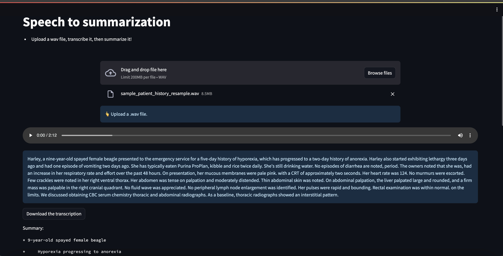
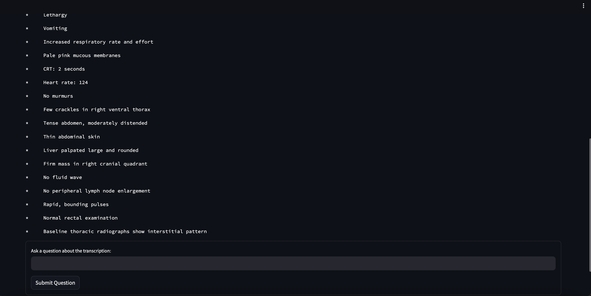

# Medical summarization and transcription

This repo will contain explorations on using LLMs and ASR to process different types of medical data. Here is an example of the streamlit app. Below is a sample transcribed patient history. This can then be summarized to pull out pertinant information. The audio clip used here is 
`./audio/sample_patient_history.wav`.




## Getting started

### Docker

The docker image can be built using `./Dockerfile`. You can build it using the following command, run from the root directory

```bash
docker build --build-arg WB_API_KEY=<your_api_key> . -f Dockerfile --rm -t llm-finetuning:latest
```

### Run docker container

First navigate to this repo on your local machine. Then run the container:

```bash
docker run --gpus all --name medical-summarization-and-transcription -it --rm -p 8888:8888 -p 8501:8501 -p 8000:8000 --entrypoint /bin/bash -w /medical-summarization-and-transcription -v $(pwd):/medical-summarization-and-transcription llm-finetuning:latest
```

### Run jupyter from the container
Inside the Container:
```bash
jupyter lab --ip 0.0.0.0 --no-browser --allow-root --NotebookApp.token=''
```

Host machine access this url:
```bash
localhost:8888/<YOUR TREE HERE>
```

### Run streamlit from the container
Inside the container:
```bash
streamlit run app.py
```

Host machine:
```bash
localhost:8501
```

## Examples
- Evalueate pre-trained models on pubmed dataset: `./notebooks/dataset.ipynb`
- Adjust audio sample rate to preprocess for Whisper model: `./notebooks/speech_sample_rate.ipynb`
- Speech to text to summarization streamlit app: `./app.py`

## TODO
1. Evaluate pre-trained models on pubmed dataset
    1. Models:
        1. https://huggingface.co/Falconsai/medical_summarization
        2. https://huggingface.co/facebook/bart-large-cnn/discussions 
        3. https://huggingface.co/Stancld/longt5-tglobal-large-16384-pubmed-3k_steps
    2. Dataset:
        1. https://huggingface.co/datasets/ccdv/pubmed-summarization
    3. Evaluation metric: rouge
2. Train model on pubmed dataset
3. Audio transcription: transcribe conversations between patients and doctors
    1. Models:
        1. https://huggingface.co/openai/whisper-large-v3
        2. https://huggingface.co/distil-whisper/distil-large-v2
        3. https://huggingface.co/pyannote/speaker-diarization-3.1
    2. Datasets:
        1. https://github.com/nazmulkazi/dataset_automated_medical_transcription
        2. https://mtsamples.com/ 
4. Experiment with phi-3-mini 4k and 128k instruct models, experiment with llama 3 8B, 8B Instruct models.